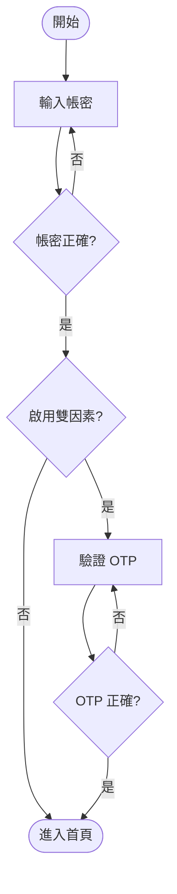

# flowchart — 產生 Mermaid 流程圖

把「一段流程／決策邏輯／既有程式碼或文件描述的步驟」轉成一張**語法正確、可直接渲染**的 Mermaid 圖。Claude Code 終端、Artifacts、GitHub、Obsidian 皆原生渲染 ```mermaid 圍籬,所以輸出一律用 Mermaid 而非 ASCII art。

這個 skill 是**手動觸發**:只在使用者點名時跑。它的價值在於一次把 Mermaid 的語法陷阱處理掉,不用每次重踩。

## 流程

1. **先確認要畫什麼**——來源可能是三種,對應不同起手:
   - **文字描述**:使用者用自然語言講流程/決策 → 直接抽節點與邊。
   - **既有程式碼/函式**:先讀相關檔(用 Read/Grep 定位,別整庫盲讀),把控制流(分支、迴圈、early return、錯誤路徑)逆推成節點。
   - **既有文件/流程**:讀來源,萃取步驟與判斷點。

   若步驟或分支不明確(缺結束條件、某判斷的另一支去哪),**先問一題再畫**,不要自行腦補流程——畫錯的圖比沒有圖更誤導。

2. **選圖型**(預設 flowchart,別過度):
   - **flowchart**——有先後步驟、判斷分支、迴圈。九成情況用這個。
   - **sequenceDiagram**——重點是多個角色/服務之間的**訊息往返時序**(A 呼叫 B、B 回 C)。
   - **stateDiagram-v2**——重點是**狀態轉移**(pending → running → done,及觸發轉移的事件)。

3. **選方向**:縱向流程用 `flowchart TD`(top-down),節點多、標籤長或偏線性用 `flowchart LR`(left-right)較好讀。

4. **輸出**:把圖放進 ```mermaid 圍籬直接回給使用者。預設**只輸出圖**,不逐節點複述文字(圖本身就是說明)。若使用者要存檔,寫成 `.md` 檔(內含 ```mermaid 區塊)。

5. **需要看實際渲染**時(選配、別預設就做):要把圖**傳給沒有 Mermaid 渲染環境的人**,或想**在瀏覽器即時微調**,產生 mermaid.live 連結(見下節)。

## 給沒有渲染環境的人看:mermaid.live 連結

多數載體(Claude Code 終端、GitHub、Obsidian)都原生渲染 ```mermaid,所以**預設不必產連結**。但當對方沒有這些環境(貼進 email、Slack、純文字工具),或使用者想線上調整時,產一條 mermaid.live 連結最省事。

本 skill 目錄下有 `scripts/mermaid-live-link.mjs`,純 Node 內建 `zlib` 編碼(零相依),把 Mermaid 原始碼經 stdin 餵進去即得連結:

```
# 唯讀檢視連結(預設,給人看渲染結果用這個)
printf '<mermaid 原始碼>' | node <本 skill 目錄>/scripts/mermaid-live-link.mjs

# 線上可編輯連結
printf '<mermaid 原始碼>' | node <本 skill 目錄>/scripts/mermaid-live-link.mjs edit
```

命令 cwd 是使用者當前專案、不是 skill 目錄,所以用**絕對路徑**(取上方「Base directory for this skill」接 `scripts/mermaid-live-link.mjs`)。從 heredoc 或檔案餵原始碼即可,不必手動轉義。**預設給 `/view`(唯讀)**——「給人看渲染結果」用 view;只有使用者明講要線上改才給 `edit`。

**輸出連結的兩條鐵律**(踩過雷):

- **逐字原樣貼腳本的 stdout,絕不手動重打或截斷**。連結尾段是 base64,差一個字元 deflate 就解成壞資料、圖渲染成亂七八糟——而且看起來像「渲染出來但怪怪的」,不會報錯,很難察覺。要複製就整條複製,別自己重敲。
- **用 markdown 連結格式 `[說明](url)` 給,別塞進 ``` 程式碼區塊**。code block 裡的網址在終端不可點;markdown 連結才能直接點開。

## Mermaid 語法要點(踩雷區,務必守住)

節點形狀——用形狀傳達語意,別全用矩形:

```
A[矩形:一般步驟]
B(圓角:起點/終點也常用)
C{菱形:判斷/是非分岔}
D([體育場形:開始/結束])
E[[子程序]]
F[(資料庫)]
G((圓形:連接點))
```

邊與標籤:

```
A --> B            實線箭頭
A -->|是| C        帶標籤(判斷分支必標「是/否」)
A -- 文字 --> C     等價寫法
A -.-> D           虛線(次要/可選路徑)
A ==> E            粗線(主幹)
```

**最容易生語法錯誤的四件事**——照這樣避開:

- **標籤含特殊字元一律加引號**:括號 `()`、方括號 `[]`、冒號、`#`、`"`、`|` 出現在節點文字裡時,必須包引號:`A["回傳 payload (含 token)"]`。不包會 parse error 或截斷。
- **`end` 不能當節點 id**(Mermaid 保留字,小寫尤其會壞):用 `End`、`stop`、`done` 之類代替。
- **節點 id 用英數**(`step1`、`checkAuth`),把中文/空白/符號放進**標籤**(`step1[驗證權限]`),別拿中文當 id。
- **中文標點在引號內沒問題**,但引號本身要用直引號 `"`,別用全形 `「」` 當語法引號(當文字內容則無妨)。

分組用 subgraph(有階段/泳道時):

```
flowchart TD
  subgraph 前處理
    a[讀輸入] --> b{格式正確?}
  end
  b -->|否| err[報錯結束]
  b -->|是| c[進主流程]
```

## 範例

**輸入**:使用者說「登入流程:輸入帳密 → 驗證,失敗回登入頁,成功且有雙因素就要驗 OTP,沒有就直接進首頁」

**輸出**:



## 邊界

- 每個判斷節點的**每一條分支都要有去向**(包含失敗/否的路徑)——漏掉分支是最常見的錯,輸出前自查一遍。
- 圖太大(超過 ~25 節點)時,先問使用者要不要拆成數張(主流程一張、子流程各一張),別硬塞成一張看不懂的圖。
- 這個 skill 只**產生**圖,不負責把圖嵌進特定專案的文件結構——那由使用者或當下情境決定放哪。
